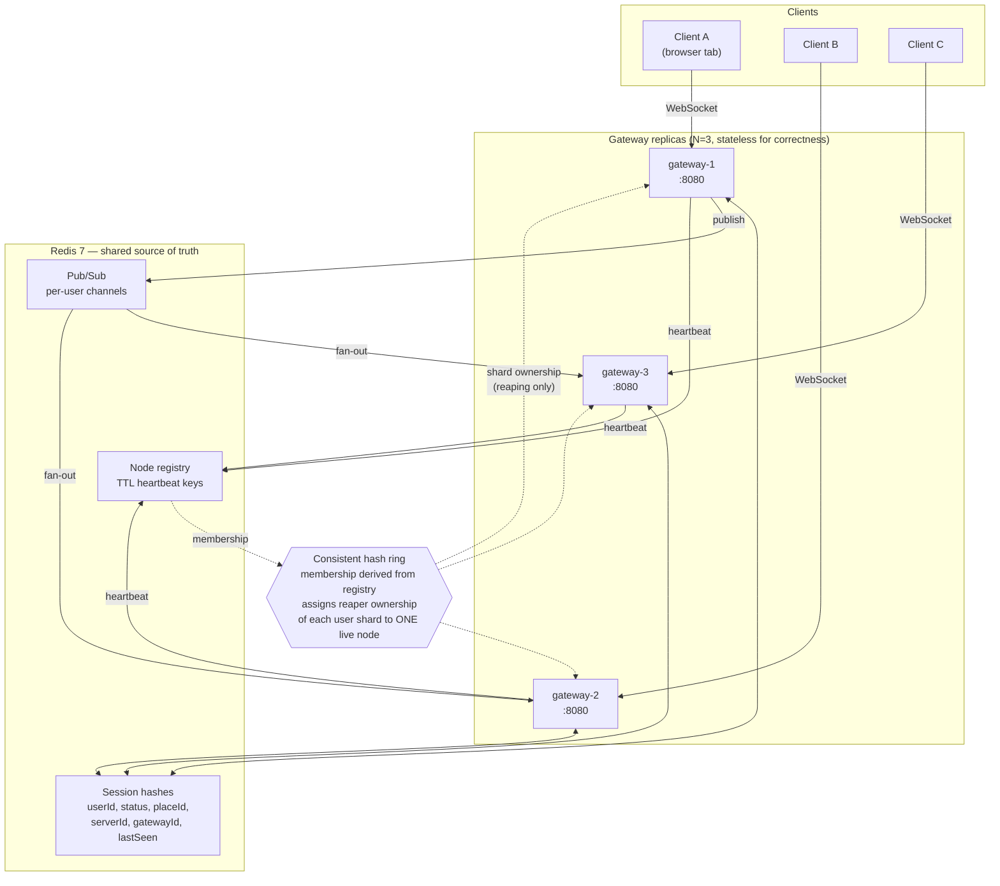

# Beacon

A horizontally-sharded, real-time **presence and session-join service** — the
backend primitive behind "see which friends are online" and "join my friend's
game."

Built at local scale with honest measurement. The interesting claim is not that
WebSockets work; it is that presence stays correct across multiple gateway
nodes, and that killing a node produces numbers rather than hand-waving.

> Beacon is built incrementally, one branch per step. The sections below
> describe the project as a whole; the [Build log](#build-log) records what each
> branch was for. Anything not yet implemented is marked as such, and the
> benchmark table stays empty until real runs fill it.

---

## The problem

Presence is trivial on one server and hard on three. With a single process you
keep a map of `userId -> status` and push changes to whoever is watching. Add a
second gateway and that map is split across processes that cannot see each
other's memory, and three separate problems appear at once. A client on gateway
A subscribing to a user connected to gateway C needs a path for that update to
cross nodes. A `JOIN` request has to resolve a target whose session is almost
never held by the node answering the request. And a client that disappears
without closing cleanly leaves a session behind that something must reap —
exactly once rather than once per replica, and reliably even when the node that
died *is* the node that owned the session.

Beacon exists to get those three right and to **measure** the failure behaviour
rather than assume it.

## Goals

1. **Correctness across nodes.** A presence change on gateway A must reach a
   subscriber on gateway C, and a `JOIN` must resolve a target connected
   anywhere in the cluster.
2. **Exactly-once cleanup under failure.** Stale sessions are reaped once, not
   N times, and a gateway dying must not strand the sessions it owned.
3. **Self-defending state.** The service actively checks its own invariants and
   exports violations as metrics instead of absorbing them silently.
4. **Measured, not assumed.** Failover cost and connection ceiling come from
   benchmarks actually run on the hardware named below. An honest low number
   beats an impressive invented one.

### Non-goals

Real authentication, persistence beyond Redis, multi-region operation, and
horizontal scaling of Redis itself. `token` is a dev-mode shared secret and no
credentials are stored.

## Architecture



**Reading the diagram.** Clients attach to any gateway; there is no affinity.
Session state is written to Redis hashes, so any replica can answer for any
user. Presence changes fan out over per-user pub/sub channels, and a gateway
subscribes only to the channels its own clients asked for — so a change on
gateway 1 reaches a subscriber on gateway 3 without the two nodes ever talking
directly.

The ring is drawn dotted because it carries **no client traffic**. Its only job
is deciding which single live gateway reaps stale sessions for a given user
shard. Membership derives from the TTL-based node registry, so a gateway that
dies stops heartbeating, drops out of the registry, and the ring rebalances its
shards onto survivors without any explicit failover signal.

## Protocol

JSON frames over a single WebSocket.

| Direction | Message | Payload |
|---|---|---|
| C→S | `HELLO` | `{userId, token}` |
| S→C | `WELCOME` | `{sessionId, gatewayId}` |
| C→S | `SUBSCRIBE` | `{userIds: []}` — returns current snapshots |
| C→S | `HEARTBEAT` | `{}` → `ACK` |
| C→S | `SET_PRESENCE` | `{status, placeId, serverId}` |
| C→S | `JOIN` | `{targetUserId}` → `JOIN_OK {placeId, serverId}` or `JOIN_DENIED {reason}` |
| S→C | `PRESENCE` | `{userId, status, placeId, ts}` |
| S→C | `ERROR` | `{code, message}` |

## Integrity checks

Beacon defends its own state and exposes violations as metrics rather than
absorbing them silently. Six checks, each with a dedicated Prometheus collector:

| # | Check | Behaviour |
|---|---|---|
| 1 | Frame validation | Reject malformed JSON, unknown types, missing fields, payloads over 8KB. Never panic on input. |
| 2 | Duplicate-session policy | A user connecting while already connected elsewhere evicts the older session deterministically, emitting its `OFFLINE` transition. |
| 3 | Out-of-order rejection | Presence events older than the stored `lastSeen` are dropped, not applied. |
| 4 | Stale-session reaper | Sessions with a lapsed heartbeat TTL are removed and transitioned to `OFFLINE` by the shard's ring-designated owner. |
| 5 | Orphan detection | Sessions whose `gatewayId` is absent from the live registry are detected and reclaimed. |
| 6 | Drift reconciliation | Sum of per-gateway in-memory connection counts compared against Redis session-set cardinality, exported as `beacon_presence_drift`. Steady state must be zero. |

## Quickstart

### Prerequisites

- Go 1.25+ (set by `prometheus/client_golang`; see the build log)
- Docker Desktop with Compose v2+ (WSL2 backend on Windows)
- GNU Make and `jq` for the bench targets

k6 is deliberately **not** a host prerequisite. It runs as a Compose service so
the load generator lives inside the Docker network namespace, avoiding the
host's ephemeral-port ceiling (16,384 ports on this Windows machine).

### Build and test

```bash
go build ./...
```

```bash
go test ./...
```

Or via Make: `make build`, `make test`, `make check` (fmt + vet + test).

The race detector needs cgo, which a stock Windows Go install lacks. Run it in a
container instead:

```bash
docker run --rm -v "$PWD:/src" -w /src -e CGO_ENABLED=1 golang:1.25 go test -race ./...
```

### Run a single gateway

```bash
BEACON_GATEWAY_ID=gw-1 BEACON_HTTP_ADDR=127.0.0.1:8080 go run ./cmd/gateway
```

```bash
curl -s localhost:8080/healthz; curl -s localhost:8080/readyz
```

### Full stack

`make up` brings up 3 gateways, Redis, Prometheus and Grafana, with the demo
client and dashboards provisioned as code. `make load` runs the k6 load test,
`make chaos` runs the gateway-kill measurement, `make down` tears it all
down.

### Configuration

| Variable | Default | Meaning |
|---|---|---|
| `BEACON_GATEWAY_ID` | container hostname | Ring key and session owner ID; must be unique per replica |
| `BEACON_HTTP_ADDR` | `:8080` | Listen address for WS, probes, metrics |
| `BEACON_REDIS_ADDR` | `localhost:6379` | Shared store, pub/sub and registry |
| `BEACON_DEV_TOKEN` | `beacon-dev-token` | Dev-mode shared secret; never logged |
| `BEACON_SHUTDOWN_GRACE` | `10s` | Drain budget on SIGTERM |

## HTTP surface

| Endpoint | Purpose |
|---|---|
| `GET /healthz` | Process liveness. Does not consult Redis. |
| `GET /readyz` | Whether this replica should receive new connections. |
| `GET /metrics` | Prometheus exposition |
| `GET /debug/ring` | Ring membership and shard ownership as JSON |
| `GET /ws` | Client WebSocket upgrade |
| `GET /` | Static demo client |

Liveness and readiness are separate signals on purpose. A gateway that has lost
Redis is still alive — restarting it would drop healthy WebSocket connections
for nothing — so it reports unready, stops taking new work, and keeps serving
what it already holds.

## Benchmark results

**No benchmarks have been run yet.** This table is intentionally empty and will
be filled from raw output committed under `bench/results/`.

| Metric | Result |
|---|---|
| Peak concurrent connections | not yet measured |
| Connection success rate | not yet measured |
| Join latency p50 / p95 / p99 | not yet measured |
| Sessions dropped on gateway kill | not yet measured |
| Time until ring excludes dead node | not yet measured |
| Time until drift returns to zero | not yet measured |
| Joins served during failover | not yet measured |

The load target is configurable and defaults to 10,000 connections. That target
may not be reachable on a single Docker Desktop host — file-descriptor and
ephemeral-port limits under WSL2 are the likely binding constraints. Whatever
ceiling is found is what gets reported, with the limiting factor named. No
number appears here that was not measured on this machine.

**Test hardware:** AMD Ryzen 7 260 (8 cores / 16 threads), 31.3 GB RAM, Windows
11, Docker Desktop 29.4.3 on the WSL2 backend with 16 CPUs and 15.3 GB allocated
to the VM.

## Design decisions

**Consistent hashing for reaper ownership.** Reaping is the one job that must
not happen N times. Every replica can see every expired session in Redis, so
without coordination all three would scan the same keys and race to publish
duplicate `OFFLINE` transitions. A ring gives each shard exactly one owner, and
gives it a property plain modulo does not: when a node leaves, only that node's
shards move. Survivors keep their existing assignments instead of everything
reshuffling — which matters most during failover, exactly when the system can
least afford extra churn.

**Redis pub/sub over direct node-to-node gossip.** Gossip would mean every
gateway maintaining connections to every other, an O(N²) mesh with its own
membership and retry logic to get wrong — a second distributed system bolted
onto the first. Redis is already a hard dependency for session state, so routing
fan-out through it keeps exactly one coordination mechanism. The tradeoff is
real and worth stating: Redis becomes a single point of failure, and pub/sub is
at-most-once, so a subscriber disconnected at the moment of publish misses the
event. Beacon compensates with snapshot-on-subscribe and the drift reconciler
rather than pretending delivery is guaranteed.

**Stateless gateways.** In-memory connection tables exist purely for efficiency.
Redis is authoritative, and any divergence between the two is treated as a
defect to report via `beacon_presence_drift` rather than something to reconcile
silently.

## Repository layout

```
cmd/gateway/          gateway process — config, HTTP surface, probes
internal/ring/        consistent hash ring + tests
internal/protocol/    frame types, codec + tests
internal/metrics/     Prometheus collectors
internal/presence/    session store, pub/sub, reaper, integrity checks
web/                  static demo client
deploy/               docker-compose, prometheus, grafana provisioning
bench/                load.js, chaos.sh, results/
docs/                 architecture notes
Makefile              build, test, up, down, load, chaos
```

---

## Build log

One entry per branch, describing what that branch was for. The sections above
describe Beacon as it is intended to work; this section is the history of how it
got there.

### `scaffold` — repository skeleton and a gateway that actually runs

Fixes the shape of the project before any distributed-systems code exists, so
later steps argue about behaviour rather than layout: the Go module, the package
tree with each package's responsibility as a doc comment, a `Makefile`, and a
gateway that is a real process — env-driven config, structured `slog` output,
graceful SIGTERM drain, and split liveness/readiness probes. Two
Windows-specific calls came out of it: `.gitattributes` forces LF so shell
scripts survive Linux containers, and `-race` runs inside a `golang` container
since cgo is unavailable natively.

*Verified:* `go build`, `go vet`, `gofmt` clean, `go test ./...` (5 pass),
race-clean in a container, plus a runtime smoke test of the probes.

### `ring` — the dependency-light core: ring, protocol codec, metrics

Three packages that can be fully tested without Redis, a network, or a running
container, so their behaviour is pinned before anything distributed is built on
top. The consistent hash ring places each gateway at 150 virtual positions and
rebuilds wholesale on membership change, which makes assignment depend only on
the member set and never on the order membership was learned — two gateways
reading the same registry in different orders must agree, or a shard ends up
with two owners or none. The protocol codec validates in two stages: `Decode`
checks the envelope (8KB cap enforced before parsing, UTF-8, JSON
well-formedness, and whether the type is one a client may send), then per-type
decoders check payloads. Identifiers are shape-checked because they become
Redis key fragments and pub/sub channel names. The metrics package declares all
28 collectors centrally and pre-seeds known label values, so a check that has
never fired shows as zero rather than "No data" — an empty Grafana panel
otherwise looks identical to a misnamed metric.

Adding `prometheus/client_golang` raised the module's Go directive from 1.22 to
1.25; the prerequisite and the container tag above were updated to match.

*Verified:* 56 tests, 74 subtests, all passing; race-clean under `golang:1.25`;
`FuzzDecode` ran 390,827 executions with no crash. Measured on this machine:
ring distribution across 3 nodes was **31.02 / 35.35 / 33.63%** (worst deviation
6.93% from a fair share over 100,000 keys); removing a node reassigned **exactly**
the 6,967 keys it owned and moved no others; adding a fourth node moved 22.57% of
keys, all of them to the new node. `Lookup` benchmarks at 197.8 ns/op and a full
ring rebuild at 133 µs.

## License

Unlicensed personal project. All dependencies are free and open source; nothing
here requires an account, an API key, or a paid service.
