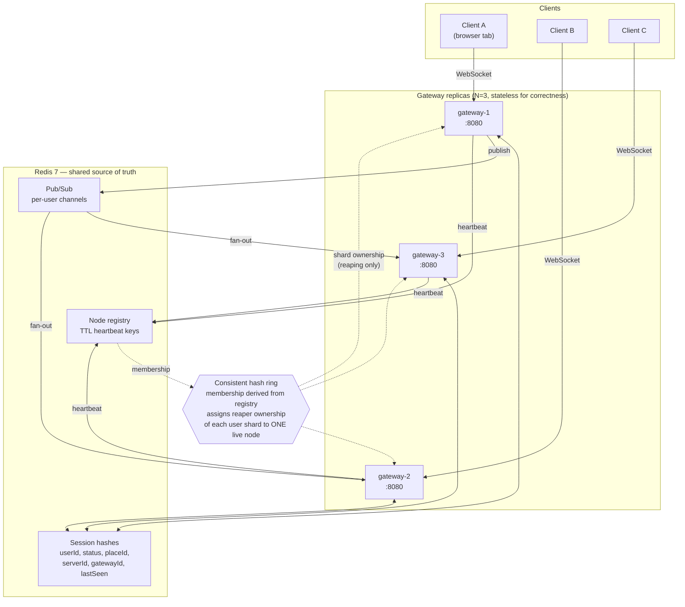

# Beacon

A horizontally-sharded, real-time **presence and session-join service** — the
backend primitive behind "see which friends are online" and "join my friend's
game."

Built at local scale with honest measurement. The interesting claim is not that
WebSockets work; it is that presence stays correct across multiple gateway
nodes, and that killing a node produces numbers rather than hand-waving.

> Beacon is built incrementally, one branch per step. The sections below
> describe the project as a whole; the [Build log](#build-log) records what each
> branch was for. Anything not yet implemented is marked as such, and the
> benchmark table stays empty until real runs fill it.

---

## The problem

Presence is trivial on one server and hard on three. With a single process you
keep a map of `userId -> status` and push changes to whoever is watching. Add a
second gateway and that map is split across processes that cannot see each
other's memory, and three separate problems appear at once. A client on gateway
A subscribing to a user connected to gateway C needs a path for that update to
cross nodes. A `JOIN` request has to resolve a target whose session is almost
never held by the node answering the request. And a client that disappears
without closing cleanly leaves a session behind that something must reap —
exactly once rather than once per replica, and reliably even when the node that
died *is* the node that owned the session.

Beacon exists to get those three right and to **measure** the failure behaviour
rather than assume it.

## Goals

1. **Correctness across nodes.** A presence change on gateway A must reach a
   subscriber on gateway C, and a `JOIN` must resolve a target connected
   anywhere in the cluster.
2. **Exactly-once cleanup under failure.** Stale sessions are reaped once, not
   N times, and a gateway dying must not strand the sessions it owned.
3. **Self-defending state.** The service actively checks its own invariants and
   exports violations as metrics instead of absorbing them silently.
4. **Measured, not assumed.** Failover cost and connection ceiling come from
   benchmarks actually run on the hardware named below. An honest low number
   beats an impressive invented one.

### Non-goals

Real authentication, persistence beyond Redis, multi-region operation, and
horizontal scaling of Redis itself. `token` is a dev-mode shared secret and no
credentials are stored.

## Architecture



**Reading the diagram.** Clients attach to any gateway; there is no affinity.
Session state is written to Redis hashes, so any replica can answer for any
user. Presence changes fan out over per-user pub/sub channels, and a gateway
subscribes only to the channels its own clients asked for — so a change on
gateway 1 reaches a subscriber on gateway 3 without the two nodes ever talking
directly.

The ring is drawn dotted because it carries **no client traffic**. Its only job
is deciding which single live gateway reaps stale sessions for a given user
shard. Membership derives from the TTL-based node registry, so a gateway that
dies stops heartbeating, drops out of the registry, and the ring rebalances its
shards onto survivors without any explicit failover signal.

## Protocol

JSON frames over a single WebSocket.

| Direction | Message | Payload |
|---|---|---|
| C→S | `HELLO` | `{userId, token}` |
| S→C | `WELCOME` | `{sessionId, gatewayId}` |
| C→S | `SUBSCRIBE` | `{userIds: []}` — returns current snapshots |
| C→S | `HEARTBEAT` | `{}` → `ACK` |
| C→S | `SET_PRESENCE` | `{status, placeId, serverId}` |
| C→S | `JOIN` | `{targetUserId}` → `JOIN_OK {placeId, serverId}` or `JOIN_DENIED {reason}` |
| S→C | `PRESENCE` | `{userId, status, placeId, ts}` |
| S→C | `ERROR` | `{code, message}` |

## Integrity checks

Beacon defends its own state and exposes violations as metrics rather than
absorbing them silently. Six checks, each with a dedicated Prometheus collector:

| # | Check | Behaviour |
|---|---|---|
| 1 | Frame validation | Reject malformed JSON, unknown types, missing fields, payloads over 8KB. Never panic on input. |
| 2 | Duplicate-session policy | A user connecting while already connected elsewhere evicts the older session deterministically, emitting its `OFFLINE` transition. |
| 3 | Out-of-order rejection | Presence events older than the stored `lastSeen` are dropped, not applied. |
| 4 | Stale-session reaper | Sessions with a lapsed heartbeat TTL are removed and transitioned to `OFFLINE` by the shard's ring-designated owner. |
| 5 | Orphan detection | Sessions whose `gatewayId` is absent from the live registry are detected and reclaimed. |
| 6 | Drift reconciliation | Sum of per-gateway in-memory connection counts compared against Redis session-set cardinality, exported as `beacon_presence_drift`. Steady state must be zero. |

## Quickstart

### Prerequisites

- Go 1.25+ (set by `prometheus/client_golang`; see the build log)
- Docker Desktop with Compose v2+ (WSL2 backend on Windows)
- GNU Make and `jq` for the bench targets

k6 is deliberately **not** a host prerequisite. It runs as a Compose service so
the load generator lives inside the Docker network namespace, avoiding the
host's ephemeral-port ceiling (16,384 ports on this Windows machine).

### Build and test

```bash
go build ./...
```

```bash
go test ./...
```

Or via Make: `make build`, `make test`, `make check` (fmt + vet + test).

The race detector needs cgo, which a stock Windows Go install lacks. Run it in a
container instead:

```bash
docker run --rm -v "$PWD:/src" -w /src -e CGO_ENABLED=1 golang:1.25 go test -race ./...
```

### Run a single gateway

```bash
BEACON_GATEWAY_ID=gw-1 BEACON_HTTP_ADDR=127.0.0.1:8080 go run ./cmd/gateway
```

```bash
curl -s localhost:8080/healthz; curl -s localhost:8080/readyz
```

### Full stack

```bash
docker compose -f deploy/docker-compose.yml up -d --build
```

| Service | URL |
|---|---|
| Demo client | http://localhost:8081 (also `:8082`, `:8083`) |
| Grafana | http://localhost:3000 — anonymous, dashboards pre-provisioned |
| Prometheus | http://localhost:9090 |
| Ring state | http://localhost:8081/debug/ring |

**To see cross-node fan-out for yourself:** open http://localhost:8081 in one tab
and http://localhost:8082 in another, connect as `alice` and `bob`, have bob
subscribe to `alice`, then change alice's presence. Bob's tab updates without
the two gateways ever talking to each other.

`make up`, `make down`, `make logs`, `make load` and `make chaos` wrap the same
commands.

### Integration tests

With the stack running:

```bash
go test -tags=integration -count=1 -v ./test/...
```

These pin two clients to *different* gateway processes and assert that presence
crosses the boundary — the one thing unit tests against an in-process fake
cannot show.

### Configuration

| Variable | Default | Meaning |
|---|---|---|
| `BEACON_GATEWAY_ID` | container hostname | Ring key and session owner ID; must be unique per replica |
| `BEACON_HTTP_ADDR` | `:8080` | Listen address for WS, probes, metrics |
| `BEACON_REDIS_ADDR` | `localhost:6379` | Shared store, pub/sub and registry |
| `BEACON_DEV_TOKEN` | `beacon-dev-token` | Dev-mode shared secret; never logged |
| `BEACON_SHUTDOWN_GRACE` | `10s` | Drain budget on SIGTERM |

## HTTP surface

| Endpoint | Purpose |
|---|---|
| `GET /healthz` | Process liveness. Does not consult Redis. |
| `GET /readyz` | Whether this replica should receive new connections. |
| `GET /metrics` | Prometheus exposition |
| `GET /debug/ring` | Ring membership and shard ownership as JSON |
| `GET /ws` | Client WebSocket upgrade |
| `GET /` | Static demo client |

Liveness and readiness are separate signals on purpose. A gateway that has lost
Redis is still alive — restarting it would drop healthy WebSocket connections
for nothing — so it reports unready, stops taking new work, and keeps serving
what it already holds.

## Benchmark results

Every number below was measured on this machine. Raw output is committed under
[`bench/results/`](bench/results/) so each figure traces back to the run that
produced it.

**Test hardware:** AMD Ryzen 7 260 (8 cores / 16 threads), 31.3 GB RAM, Windows
11, Docker Desktop 29.4.3 on the WSL2 backend with 16 CPUs and 15.3 GB allocated
to the VM. All six containers plus the k6 load generator share that budget.

### Load — connection ceiling

The default target of 10,000 was met, so the ramp continued upward until it
broke. Each row is one k6 run: connections ramp, hold, then drain.

| Connections | Connect success | Connect p99 | JOIN p95 | JOIN p99 | JOINs answered | Verdict |
|---:|---:|---:|---:|---:|---:|---|
| 10,000 | **100%** | 44 ms | 18 ms | **27 ms** | 100% (204,850) | clean |
| 20,000 | **100%** | 59 ms | 18 ms | **38 ms** | 100% (469,215) | clean — all thresholds passed |
| 30,000 | 100% | 227 ms | 195 ms | 1,323 ms | 100% (784,130) | degraded — latency threshold missed |
| 40,000 | 100% | 4,429 ms | 4,498 ms | 4,894 ms | 97.2% (900,641 / 926,347) | broken — 43 socket errors |

**20,000 concurrent WebSocket connections is the highest fully clean result**,
holding 100% connection success and 100% of 469,215 cross-gateway JOINs answered
at a p99 of 38 ms. Gateway-side counters confirm the client-side figure: at the
10,000 run the three replicas reported 3,600 / 3,200 / 3,200 active connections.

Every JOIN in these runs is a cross-node resolution. The load script pairs each
client with a peer on a *different* gateway, so a local-lookup fast path would
not be exercised.

### The limiting factor is the reaper, not the host

The obvious suspects were all ruled out by the gateways' own process metrics at
peak:

| Resource | Peak observed | Limit | Binding? |
|---|---:|---:|---|
| Open file descriptors | 13,673 | 1,048,576 | No — the Compose `ulimits` setting works |
| Resident memory per gateway | 505 MB | ~15 GB available | No |
| CPU per gateway | 1.55 cores | 16 cores | No |
| Ephemeral ports | — | per-container namespace | No — k6 runs inside the Docker network |
| **Reaper sweep p99** | **≥ 5 s** | 2 s sweep interval | **Yes** |

The reaper issues one pipelined `HMGET` per session it owns. At 40,000 sessions
that is roughly 13,000 commands in a single burst per gateway, which saturates
the shared Redis connection pool and starves the `HGETALL` that a JOIN needs.
JOIN latency degrades precisely as sweep duration crosses the sweep interval —
at which point sweeps also begin to overlap and cleanup falls behind.

This is a Beacon design limit rather than a host limit, and it is fixable:
chunk the sweep across several intervals, or give the reaper its own Redis pool
so a scan cannot contend with request traffic. Neither is done here, and the
number reported is the number as built.

### Chaos — killing a gateway under load

`docker kill` on `gateway-2` with 6,000 connections established. SIGKILL, so
there is no graceful deregistration: the ring has to notice via TTL expiry.

| Measurement | Result |
|---|---:|
| Connections before the kill | 6,000 |
| Sessions dropped by the kill | **1,920** (everything the victim held) |
| Connections retained on survivors | 4,080 |
| Drift first observed non-zero | T+6.60 s |
| Peak drift | **−1,920** |
| **Time until drift returned to zero** | **T+9.56 s** (≈3.0 s to reconcile) |
| Time until the ring excluded the dead node | 9.54 s |
| Orphaned sessions reclaimed | **1,920 — exactly the victim's count** |
| JOINs served by survivors during the window | **4,241** |
| Time for the restarted node to rejoin the ring | 1.73 s |

Reading the sequence: the victim's registry key expires 6 s after the kill
(`BEACON_NODE_TTL`), at which point its connections leave the in-memory total
while its sessions remain in Redis — drift drops to −1,920. The surviving
gateways rebuild the ring, take ownership of the orphaned shards, and reclaim
them over the next few sweeps. The committed drift trace shows the reconciliation
step by step: `−1920 → −1883 → −307 → 0`.

The two numbers that matter most: **no session was lost or double-counted** —
reclamation matched the victim's connection count exactly — and **survivors kept
serving JOINs throughout**, 4,241 of them during the failure window.

The dominant term in failover time is `BEACON_NODE_TTL`, set to 6 s (3× the
registry heartbeat). Lowering it shortens failover directly, at the cost of
evicting healthy gateways during a GC pause or a slow Redis round trip.

### Reproducing

```bash
docker compose -f deploy/docker-compose.yml run --rm -e LOAD_VUS=20000 -e CONNS_PER_VU=40 k6 run /scripts/load.js
```

```bash
bash bench/chaos.sh 6000 beacon-gateway-2
```

## Design decisions

**Consistent hashing for reaper ownership.** Reaping is the one job that must
not happen N times. Every replica can see every expired session in Redis, so
without coordination all three would scan the same keys and race to publish
duplicate `OFFLINE` transitions. A ring gives each shard exactly one owner, and
gives it a property plain modulo does not: when a node leaves, only that node's
shards move. Survivors keep their existing assignments instead of everything
reshuffling — which matters most during failover, exactly when the system can
least afford extra churn.

**Redis pub/sub over direct node-to-node gossip.** Gossip would mean every
gateway maintaining connections to every other, an O(N²) mesh with its own
membership and retry logic to get wrong — a second distributed system bolted
onto the first. Redis is already a hard dependency for session state, so routing
fan-out through it keeps exactly one coordination mechanism. The tradeoff is
real and worth stating: Redis becomes a single point of failure, and pub/sub is
at-most-once, so a subscriber disconnected at the moment of publish misses the
event. Beacon compensates with snapshot-on-subscribe and the drift reconciler
rather than pretending delivery is guaranteed.

**Duplicate-session policy: last writer wins, and the user does not go offline.**
When a user connects while already connected elsewhere, the new connection takes
the session and the old one is evicted. The alternative — rejecting the newcomer
— strands a user whose previous session is a half-dead socket the owning gateway
has not yet noticed, which is the common case rather than the rare one.

The eviction notice is addressed to the specific gateway holding the old
session, over a per-gateway control channel, because the claiming gateway
already learns the displaced gateway's ID from the claim script. That costs one
subscription per gateway instead of one per connection.

The evicted client is sent an `OFFLINE` presence frame and an `ERROR`, then
closed — but that `OFFLINE` is deliberately **not** published to the bus. The
*session* ended; the *user* did not. They are live on the connection that
displaced this one, and publishing a cluster-wide `OFFLINE` would race the new
session's `ONLINE` and could leave every watcher believing a connected user is
offline. Eviction also sticks without relying on that notice arriving: the
evicted connection's next heartbeat fails the session-ID check in Redis and
closes itself.

**Stateless gateways.** In-memory connection tables exist purely for efficiency.
Redis is authoritative, and any divergence between the two is treated as a
defect to report via `beacon_presence_drift` rather than something to reconcile
silently.

## Known limitations

**The reaper's sweep is unchunked**, and it is what caps throughput. One
pipelined `HMGET` per owned session means a burst of ~13,000 Redis commands per
gateway at 40,000 sessions, contending with the request path on the same
connection pool. Measured: sweep p99 crosses the 2 s sweep interval somewhere
between 20,000 and 30,000 connections, and JOIN p99 degrades with it. The fix is
to chunk the scan across intervals or give the reaper a dedicated pool.

**Redis is a single point of failure.** The whole design routes coordination
through it. Losing Redis does not drop existing WebSocket connections — gateways
report unready and keep serving what they hold — but no presence change
propagates and no JOIN resolves.

**Pub/sub is at-most-once.** A subscriber disconnected at the instant of a
publish misses the event. Snapshot-on-subscribe and the drift reconciler
compensate; nothing pretends delivery is guaranteed.

**Failover time is dominated by a TTL.** 6 s of the ~9.5 s convergence measured
above is `BEACON_NODE_TTL` elapsing. That is a tuning choice, not a discovered
constant, and it trades failover speed against flapping healthy nodes.

**`token` is not authentication.** It is a shared secret from an environment
variable, present so the protocol has a rejection path to exercise.

**One Redis, one region, no persistence.** Session state is deliberately
ephemeral. Sharding Redis itself is out of scope.

## Repository layout

```
cmd/gateway/          gateway process — config, HTTP surface, probes
internal/ring/        consistent hash ring + tests
internal/protocol/    frame types, codec + tests
internal/metrics/     Prometheus collectors
internal/presence/    session store, pub/sub, reaper, integrity checks
web/                  static demo client
deploy/               docker-compose, prometheus, grafana provisioning
bench/                load.js, chaos.sh, results/
docs/                 architecture notes
Makefile              build, test, up, down, load, chaos
```

---

## Build log

One entry per branch, describing what that branch was for. The sections above
describe Beacon as it is intended to work; this section is the history of how it
got there.

### `scaffold` — repository skeleton and a gateway that actually runs

Fixes the shape of the project before any distributed-systems code exists, so
later steps argue about behaviour rather than layout: the Go module, the package
tree with each package's responsibility as a doc comment, a `Makefile`, and a
gateway that is a real process — env-driven config, structured `slog` output,
graceful SIGTERM drain, and split liveness/readiness probes. Two
Windows-specific calls came out of it: `.gitattributes` forces LF so shell
scripts survive Linux containers, and `-race` runs inside a `golang` container
since cgo is unavailable natively.

*Verified:* `go build`, `go vet`, `gofmt` clean, `go test ./...` (5 pass),
race-clean in a container, plus a runtime smoke test of the probes.

### `system` — the running cluster: presence, gateway, demo client, deploy stack

Everything that turns the previous branch's pure functions into a service. The
presence layer puts session state in Redis behind Lua scripts, because three
gateways can act on the same user concurrently and a read-modify-write done in
Go would let a stale presence overwrite a fresh one between the read and the
write — exactly the corruption the out-of-order check exists to prevent. Node
liveness is a TTL rather than a flag: a gateway that dies stops refreshing its
key and disappears, so there is no failover path that can itself fail. The
reaper handles both a session whose hash expired and one whose gateway vanished,
and only for shards the ring assigns it. The gateway adds the WebSocket
transport, `/metrics`, `/debug/ring` and a static demo client, and `deploy/`
brings up three replicas, Redis, Prometheus and Grafana with both dashboards
provisioned as code.

One bug worth recording: `close()` originally tore down the socket directly, so
a rejected client never received the `ERROR` explaining why — the frame was
still queued when the connection went away. The write pump now owns the socket
and drains before closing, which is also what makes eviction observable to the
client being evicted.

*Verified:* 121 unit tests and 86 subtests passing, race-clean under
`golang:1.25`. Against the live Compose stack: all three gateways healthy and
agreeing on ring membership, **presence propagated gateway-1 → gateway-3**,
`JOIN` resolved a target connected to another node from all three gateways,
cross-gateway duplicate eviction fired, malformed frames rejected without
dropping the connection, and `beacon_presence_drift` read zero on every node.
Every Grafana panel query was checked against live Prometheus data rather than
assumed — measured JOIN p99 at that moment was 495 µs.

### `bench` — measurement, and finding the actual ceiling

The k6 script uses `k6/experimental/websockets` rather than the legacy blocking
`k6/ws`, because one VU per connection would have meant 10,000 VUs and several
GB of generator overhead — k6 would have run out of memory before Beacon ran out
of capacity, and the resulting number would have described the load generator.
Each simulated client is paired with a peer on a *different* gateway, so every
JOIN measured is a cross-node resolution.

The 10,000 target was met on the first run at 100% success, so the ramp
continued until it broke: 20,000 clean, 30,000 latency-degraded, 40,000 broken.
The interesting part is *why*. File descriptors, memory, CPU and ephemeral ports
were all ruled out from the gateways' own process metrics — peak FD use was
13,673 against a limit of 1,048,576. The binding constraint is Beacon's own
reaper: an unchunked pipelined scan that saturates the Redis pool and starves
the request path once sweep duration crosses the sweep interval.

Two measurement bugs were worth more than they cost. The chaos script initially
reported that drift never went non-zero — untrue; the drift gauge updated every
5 s and the convergence loop's own nine-HTTP-calls-per-iteration gave it ~2 s
resolution, so a ~3 s transient fell between samples. Tightening the gauge to 1 s
and adding a dedicated 10 Hz single-metric sampler turned "did not converge" into
a real timing. Separately, Git Bash's MSYS path conversion silently rewrote the
container-side `/scripts/load.js` into `C:/Program Files/Git/scripts/load.js`, so
k6 started, found nothing, and exited — reporting zero connections rather than an
error.

*Verified:* four load runs and one chaos run, raw output committed under
`bench/results/`. Headline numbers: **20,000 concurrent connections at 100%
success with cross-gateway JOIN p99 of 38 ms**; killing a gateway holding 1,920
sessions reclaimed **exactly 1,920** orphans, returned drift to zero **3.0 s**
after it diverged, and the survivors served **4,241 JOINs** during the failure.

### `ring` — the dependency-light core: ring, protocol codec, metrics

Three packages that can be fully tested without Redis, a network, or a running
container, so their behaviour is pinned before anything distributed is built on
top. The consistent hash ring places each gateway at 150 virtual positions and
rebuilds wholesale on membership change, which makes assignment depend only on
the member set and never on the order membership was learned — two gateways
reading the same registry in different orders must agree, or a shard ends up
with two owners or none. The protocol codec validates in two stages: `Decode`
checks the envelope (8KB cap enforced before parsing, UTF-8, JSON
well-formedness, and whether the type is one a client may send), then per-type
decoders check payloads. Identifiers are shape-checked because they become
Redis key fragments and pub/sub channel names. The metrics package declares all
28 collectors centrally and pre-seeds known label values, so a check that has
never fired shows as zero rather than "No data" — an empty Grafana panel
otherwise looks identical to a misnamed metric.

Adding `prometheus/client_golang` raised the module's Go directive from 1.22 to
1.25; the prerequisite and the container tag above were updated to match.

*Verified:* 56 tests, 74 subtests, all passing; race-clean under `golang:1.25`;
`FuzzDecode` ran 390,827 executions with no crash. Measured on this machine:
ring distribution across 3 nodes was **31.02 / 35.35 / 33.63%** (worst deviation
6.93% from a fair share over 100,000 keys); removing a node reassigned **exactly**
the 6,967 keys it owned and moved no others; adding a fourth node moved 22.57% of
keys, all of them to the new node. `Lookup` benchmarks at 197.8 ns/op and a full
ring rebuild at 133 µs.

## Resume bullets

Every figure below comes from a run on the hardware named in
[Benchmark results](#benchmark-results), with raw output in `bench/results/`.

- Built a horizontally-sharded real-time presence service in Go (WebSocket,
  Redis, custom consistent hash ring) sustaining **20,000 concurrent connections
  across 3 gateway replicas at 100% connection success**, answering **469,215
  cross-node session-join requests at p99 38 ms**.

- Designed TTL-based node membership with a consistent hash ring assigning
  stale-session cleanup to exactly one owner; under a `SIGKILL` of a live gateway
  holding 1,920 sessions, surviving nodes **reclaimed exactly 1,920 orphaned
  sessions with zero loss or double-count**, returned state drift to zero **3.0 s**
  after divergence, and **served 4,241 join requests during the failure window**.

- Implemented six self-auditing integrity checks (frame validation,
  duplicate-session eviction, out-of-order rejection, stale reaping, orphan
  detection, drift reconciliation), each exported to Prometheus and surfaced on
  two provisioned Grafana dashboards; verified by **121 unit tests and 86
  subtests, race-clean**, plus cross-node integration tests against a live
  3-replica cluster.

- Diagnosed the throughput ceiling from process metrics rather than assumption —
  ruling out file descriptors (**13,673 used of 1,048,576**), memory, CPU and
  ephemeral ports — and traced degradation past 20,000 connections to an
  unchunked reaper scan whose **p99 sweep exceeded its 2 s interval**, starving
  the request path on a shared Redis pool.

## License

Unlicensed personal project. All dependencies are free and open source; nothing
here requires an account, an API key, or a paid service.
