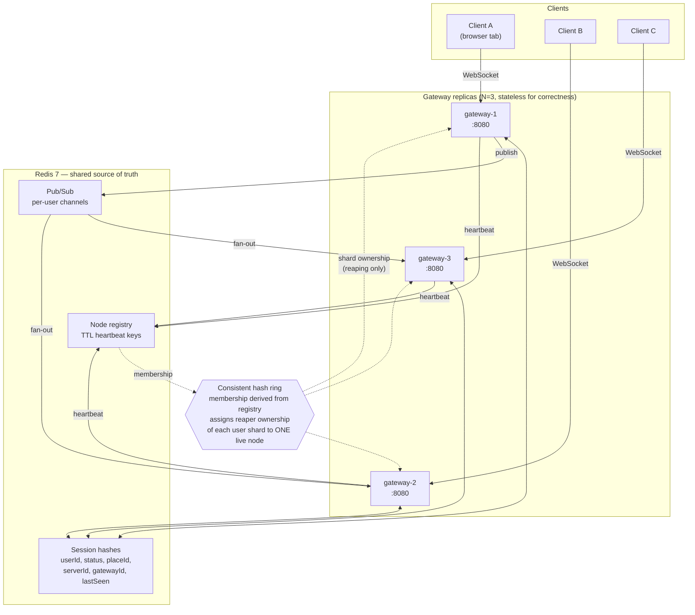

# Beacon

A horizontally-sharded presence and session-join service in Go. It is the
backend primitive behind "see which friends are online" and "join my friend's
game", built at local scale and measured honestly.

Presence is easy on one server: keep a map of `userId -> status` and push changes
to whoever is watching. Add a second server and the map is split across processes
that cannot see each other's memory. Three problems appear at once. A client on
gateway A subscribing to a user on gateway C needs a path for that update to
cross nodes. A `JOIN` has to resolve a target whose session is almost never held
by the node answering. And a client that vanishes without closing leaves a
session that something must clean up once, not once per replica, and reliably
even when the node that died is the node that owned it.

Beacon solves those three and measures what happens when a gateway is killed.

## Architecture



Clients attach to any gateway; there is no affinity. Sessions are written to
Redis hashes so any replica can answer for any user. Presence changes fan out
over per-user pub/sub channels, and a gateway subscribes only to the channels its
own clients asked for, so a change on gateway 1 reaches a subscriber on gateway 3
without the two nodes talking directly.

The ring is dotted in the diagram because it carries no client traffic. Its only
job is deciding which live gateway reaps stale sessions for a given user.
Membership comes from the TTL node registry, so a dead gateway stops
heartbeating, drops out, and the ring rebalances with no explicit failover
signal.

## Protocol

JSON frames over one WebSocket.

| Direction | Message | Payload |
|---|---|---|
| C→S | `HELLO` | `{userId, token}` |
| S→C | `WELCOME` | `{sessionId, gatewayId}` |
| C→S | `SUBSCRIBE` | `{userIds: []}` — returns current snapshots |
| C→S | `HEARTBEAT` | `{}` → `ACK` |
| C→S | `SET_PRESENCE` | `{status, placeId, serverId}` |
| C→S | `JOIN` | `{targetUserId}` → `JOIN_OK {placeId, serverId}` or `JOIN_DENIED {reason}` |
| S→C | `PRESENCE` | `{userId, status, placeId, ts}` |
| S→C | `ERROR` | `{code, message}` |

`token` is a dev-mode shared secret from an environment variable. It is not real
authentication and no credentials are stored.

## Integrity checks

Six checks run continuously, each with its own Prometheus collector and a panel
on the Integrity dashboard.

| # | Check | Behaviour |
|---|---|---|
| 1 | Frame validation | Rejects malformed JSON, unknown types, missing fields and payloads over 8KB. Never panics. |
| 2 | Duplicate sessions | A user connecting while connected elsewhere evicts the older session. |
| 3 | Out-of-order events | Presence events older than the stored `lastSeen` are dropped. |
| 4 | Stale-session reaper | Sessions with a lapsed heartbeat TTL are removed by the shard's ring owner. |
| 5 | Orphan detection | Sessions whose `gatewayId` is gone from the registry are reclaimed. |
| 6 | Drift reconciliation | In-memory connection totals compared against Redis session cardinality, exported as `beacon_presence_drift`. |

## Quickstart

**Prerequisites:** Go 1.25+, Docker Desktop with Compose v2, plus GNU Make and
`jq` for the bench targets. k6 is not needed on the host; it runs as a Compose
service.

Build and test:

```bash
go build ./... && go test ./...
```

The race detector needs cgo, which a stock Windows Go install lacks. Run it in a
container:

```bash
docker run --rm -v "$PWD:/src" -w /src -e CGO_ENABLED=1 golang:1.25 go test -race ./...
```

Bring up the stack:

```bash
docker compose -f deploy/docker-compose.yml up -d --build
```

| Service | URL |
|---|---|
| Demo client | http://localhost:8081 (also `:8082`, `:8083`) |
| Grafana | http://localhost:3000 (anonymous, dashboards pre-provisioned) |
| Prometheus | http://localhost:9090 |
| Ring state | http://localhost:8081/debug/ring |

To watch fan-out cross nodes, open `:8081` and `:8082` in two tabs, connect as
`alice` and `bob`, have bob subscribe to `alice`, then change alice's presence.

Integration tests, against a running stack:

```bash
go test -tags=integration -count=1 -v ./test/...
```

`make help` lists the wrappers: `build`, `test`, `check`, `up`, `down`, `logs`,
`integration`, `load`, `chaos`.

### Configuration

| Variable | Default | Meaning |
|---|---|---|
| `BEACON_GATEWAY_ID` | container hostname | Ring key and session owner; unique per replica |
| `BEACON_HTTP_ADDR` | `:8080` | Listen address |
| `BEACON_REDIS_ADDR` | `localhost:6379` | Store, pub/sub and registry |
| `BEACON_DEV_TOKEN` | `beacon-dev-token` | Dev-mode shared secret; never logged |
| `BEACON_SESSION_TTL` | `30s` | Session lifetime without a client heartbeat |
| `BEACON_NODE_TTL` | `6s` | Ring membership lifetime without a registry heartbeat |
| `BEACON_REAPER_INTERVAL` | `2s` | Sweep cadence |
| `BEACON_DRIFT_INTERVAL` | `1s` | Reconciliation cadence |

## HTTP surface

| Endpoint | Purpose |
|---|---|
| `GET /healthz` | Process liveness. Does not consult Redis. |
| `GET /readyz` | Whether this replica should take new connections. |
| `GET /metrics` | Prometheus exposition |
| `GET /debug/ring` | Ring membership and shard ownership as JSON |
| `GET /ws` | Client WebSocket upgrade |
| `GET /` | Static demo client |

Liveness and readiness are separate. A gateway that has lost Redis is still
alive, and restarting it would drop healthy WebSocket connections without fixing
anything, so it reports unready and keeps serving what it holds.

## Benchmark results

Measured on this machine. Raw output is in [`bench/results/`](bench/results/).

**Hardware:** AMD Ryzen 7 260 (8 cores / 16 threads), 31.3 GB RAM, Windows 11,
Docker Desktop 29.4.3 on WSL2 with 16 CPUs and 15.3 GB allocated. All six
containers and the k6 load generator share that budget.

### Connection ceiling

The 10,000 target was met on the first run, so the ramp continued until it broke.

| Connections | Connect success | Connect p99 | JOIN p95 | JOIN p99 | JOINs answered | Verdict |
|---:|---:|---:|---:|---:|---:|---|
| 10,000 | 100% | 44 ms | 18 ms | 27 ms | 100% (204,850) | clean |
| 20,000 | 100% | 59 ms | 18 ms | 38 ms | 100% (469,215) | clean, all thresholds passed |
| 30,000 | 100% | 227 ms | 195 ms | 1,323 ms | 100% (784,130) | latency threshold missed |
| 40,000 | 100% | 4,429 ms | 4,498 ms | 4,894 ms | 97.2% (900,641 / 926,347) | broken, 43 socket errors |

20,000 concurrent connections is the highest fully clean result. Gateway-side
counters agree with the client figures: at 10,000 the three replicas reported
3,600 / 3,200 / 3,200 active connections.

Every JOIN here is a cross-node resolution. The load script pairs each client
with a peer on a different gateway, so there is no local-lookup fast path.

### What limits it

The usual suspects were ruled out from the gateways' own process metrics at peak.

| Resource | Peak | Limit | Binding? |
|---|---:|---:|---|
| Open file descriptors | 13,673 | 1,048,576 | No |
| Resident memory per gateway | 505 MB | ~15 GB available | No |
| CPU per gateway | 1.55 cores | 16 cores | No |
| Ephemeral ports | — | per-container namespace | No |
| Reaper sweep p99 | ≥ 5 s | 2 s interval | **Yes** |

The reaper issues one pipelined `HMGET` per session it owns. At 40,000 sessions
that is roughly 13,000 commands in a single burst per gateway, which saturates
the Redis connection pool and starves the lookups a JOIN needs. JOIN latency
degrades as sweep duration crosses the sweep interval, at which point sweeps also
overlap and cleanup falls behind.

This is a Beacon limit, not a host limit, and it is fixable by chunking the sweep
or giving the reaper its own connection pool. Neither is done here.

### Killing a gateway under load

`docker kill` on `gateway-2` with 6,000 connections established. SIGKILL, so
there is no graceful deregistration and the ring has to notice via TTL expiry.

| Measurement | Result |
|---|---:|
| Connections before the kill | 6,000 |
| Sessions dropped | 1,920 (everything the victim held) |
| Connections retained on survivors | 4,080 |
| Drift first non-zero | T+6.60 s |
| Peak drift | −1,920 |
| Drift back to zero | T+9.56 s (3.0 s to reconcile) |
| Ring excluded the dead node | 9.54 s |
| Orphaned sessions reclaimed | 1,920, exactly the victim's count |
| JOINs served by survivors during the window | 4,241 |
| Restarted node rejoined the ring | 1.73 s |

The victim's registry key expires 6 s after the kill, at which point its
connections leave the in-memory total while its sessions remain in Redis, so
drift drops to −1,920. Survivors rebuild the ring, take ownership of the orphaned
shards and reclaim them over the next few sweeps. The committed drift trace shows
each step: `−1920 → −1883 → −307 → 0`.

Nothing was lost or double-counted, and the survivors kept answering JOINs
throughout. Failover time is dominated by `BEACON_NODE_TTL` at 6 s. Lowering it
shortens failover, at the cost of evicting healthy gateways during a GC pause.

Reproduce with:

```bash
docker compose -f deploy/docker-compose.yml run --rm -e LOAD_VUS=20000 -e CONNS_PER_VU=40 k6 run /scripts/load.js
```

```bash
bash bench/chaos.sh 6000 beacon-gateway-2
```

## Design decisions

**Consistent hashing for reaper ownership.** Every replica can see every expired
session in Redis, so without coordination all three would scan the same keys and
race to publish duplicate `OFFLINE` transitions. A ring gives each shard one
owner, and unlike plain modulo, only the departed node's shards move when a node
leaves. Survivors keep their existing assignments, which matters most during
failover.

**Redis pub/sub instead of node-to-node gossip.** Gossip means every gateway
holding connections to every other, an O(N²) mesh with its own membership and
retry logic. Redis is already required for session state, so routing fan-out
through it keeps one coordination mechanism instead of two. The costs are real:
Redis becomes a single point of failure, and pub/sub is at-most-once, so a
subscriber disconnected at the moment of publish misses the event.
Snapshot-on-subscribe and the drift reconciler cover that rather than assuming
delivery.

**Duplicate sessions: last writer wins.** A new connection takes the session and
the old one is evicted. Rejecting the newcomer would strand a user whose previous
session is a half-dead socket the owning gateway has not noticed yet, which is
the common case. The eviction notice goes to the specific gateway holding the old
session over a per-gateway control channel, costing one subscription per gateway
rather than one per connection.

The evicted client gets an `OFFLINE` frame and an `ERROR`, then is closed, but
that `OFFLINE` is not published to the bus. The session ended; the user did not.
Publishing it cluster-wide would race the new session's `ONLINE` and could leave
watchers believing a connected user is offline. Eviction still holds if the
notice never arrives: the evicted connection's next heartbeat fails the
session-ID check in Redis and closes itself.

**Stateless gateways.** In-memory connection tables exist for efficiency. Redis
is authoritative, and divergence between them is reported via
`beacon_presence_drift` rather than reconciled quietly.

## Known limitations

- **The reaper sweep is unchunked** and caps throughput. Sweep p99 crosses the
  2 s interval somewhere between 20,000 and 30,000 connections, and JOIN latency
  degrades with it.
- **Redis is a single point of failure.** Losing it does not drop existing
  connections, but no presence propagates and no JOIN resolves.
- **Pub/sub is at-most-once.** A subscriber disconnected at the instant of a
  publish misses that event.
- **Failover time is mostly a TTL.** 6 s of the ~9.5 s convergence is
  `BEACON_NODE_TTL` elapsing.
- **`token` is not authentication**, and there is no persistence, no multi-region
  support, and no sharding of Redis itself.

## Repository layout

```
cmd/gateway/          gateway process, WebSocket transport, HTTP surface
internal/ring/        consistent hash ring + tests
internal/protocol/    frame types, codec + tests
internal/metrics/     Prometheus collectors
internal/presence/    session store, pub/sub, reaper, integrity checks
web/                  static demo client
deploy/               compose, Dockerfile, prometheus, grafana
bench/                load.js, chaos.sh, results/
test/                 cross-node integration tests
docs/                 architecture notes
```

## Build log

Built one step per branch. Each entry covers what that branch was for.

### `scaffold` — repository skeleton and a gateway that runs

Set up the Go module, the package tree with each package's responsibility as a
doc comment, and a Makefile. The gateway is a real process from the start: env
config, structured `slog` output, graceful SIGTERM drain, and separate liveness
and readiness probes. `.gitattributes` forces LF endings so shell scripts and the
Makefile survive being run in Linux containers from a Windows working copy.

*Verified:* build, vet, gofmt clean, 5 tests, race-clean in a container, plus a
runtime check of the probes.

### `ring` — consistent hash ring, protocol codec, metrics

Three packages testable without Redis or a network. The ring places each gateway
at 150 virtual positions and rebuilds on membership change, so assignment depends
only on the member set and never on the order membership was learned. The codec
validates in two stages: envelope first (8KB cap before parsing, UTF-8, JSON,
type allowed from a client), then payload. The metrics package declares all 28
collectors centrally and pre-seeds known label values so a check that has not
fired reads zero instead of "No data".

Adding `prometheus/client_golang` raised the Go directive from 1.22 to 1.25.

*Verified:* 56 tests, 74 subtests, race-clean, `FuzzDecode` at 390,827 executions
with no crash. Ring distribution across 3 nodes was 31.02 / 35.35 / 33.63% over
100,000 keys, worst deviation 6.93%. Removing a node reassigned exactly the 6,967
keys it owned and moved no others. Adding a fourth moved 22.57% of keys, all to
the new node. `Lookup` benchmarks at 197.8 ns/op.

### `system` — presence layer, gateway, demo client, deploy stack

Session state moved into Redis behind Lua scripts, because three gateways can act
on the same user concurrently and a read-modify-write in Go would let a stale
presence overwrite a fresh one between the read and the write. Node liveness is a
TTL rather than a flag, so a dead gateway disappears on its own and there is no
failover path that can itself fail. The reaper handles both expired sessions and
sessions whose gateway vanished, only for shards the ring assigns it. The gateway
added WebSocket transport, `/metrics`, `/debug/ring` and the demo client, and
`deploy/` brings up three replicas with Prometheus and Grafana provisioned as
code.

One bug found here: `close()` tore down the socket directly, so a rejected client
never received the `ERROR` explaining why. The write pump now owns the socket and
drains before closing.

*Verified:* 121 tests and 86 subtests, race-clean. Against the live stack, all
three gateways agreed on ring membership, presence propagated gateway-1 to
gateway-3, `JOIN` resolved a cross-node target from all three, duplicate eviction
worked across gateways, and drift read zero everywhere. Every Grafana panel query
was checked against live Prometheus data.

### `bench` — load and chaos measurement

The k6 script uses `k6/experimental/websockets` rather than the blocking `k6/ws`,
since one VU per connection would need 10,000 VUs and several GB of generator
overhead. k6 would have run out of memory before Beacon ran out of capacity, and
the resulting number would describe the load generator. Each client is paired
with a peer on a different gateway, so every JOIN measured crosses nodes.

Two measurement bugs were worth their cost. The chaos script first reported that
drift never went non-zero, which was wrong: the gauge updated every 5 s and the
convergence loop's nine HTTP calls per iteration gave it about 2 s resolution, so
a 3 s transient fell between samples. Tightening the gauge to 1 s and adding a
dedicated 10 Hz sampler turned that into a real timing. Separately, Git Bash's
MSYS path conversion rewrote the container-side `/scripts/load.js` into
`C:/Program Files/Git/scripts/load.js`, so k6 started, found nothing and exited,
reporting zero connections instead of an error.

*Verified:* four load runs and one chaos run, raw output committed. Headline
numbers are in [Benchmark results](#benchmark-results).

## Resume bullets

Each figure comes from a run on the hardware above, with raw output in
`bench/results/`.

- Built a horizontally-sharded real-time presence service in Go (WebSocket,
  Redis, custom consistent hash ring) sustaining **20,000 concurrent connections
  across 3 gateway replicas at 100% connection success**, answering **469,215
  cross-node session-join requests at p99 38 ms**.

- Designed TTL-based node membership with a consistent hash ring assigning
  stale-session cleanup to exactly one owner. Under a `SIGKILL` of a gateway
  holding 1,920 sessions, survivors **reclaimed exactly 1,920 orphaned sessions
  with zero loss or double-count**, returned state drift to zero **3.0 s** after
  divergence, and **served 4,241 join requests during the failure window**.

- Implemented six self-auditing integrity checks (frame validation,
  duplicate-session eviction, out-of-order rejection, stale reaping, orphan
  detection, drift reconciliation), each exported to Prometheus and surfaced on
  two provisioned Grafana dashboards. Verified by **121 unit tests and 86
  subtests, race-clean**, plus cross-node integration tests against a live
  3-replica cluster.

- Diagnosed the throughput ceiling from process metrics rather than assumption,
  ruling out file descriptors (**13,673 used of 1,048,576**), memory, CPU and
  ephemeral ports, and traced degradation past 20,000 connections to an unchunked
  reaper scan whose **p99 sweep exceeded its 2 s interval**, starving the request
  path on a shared Redis pool.

## License

Unlicensed personal project. All dependencies are free and open source. Nothing
here needs an account, an API key, or a paid service.
